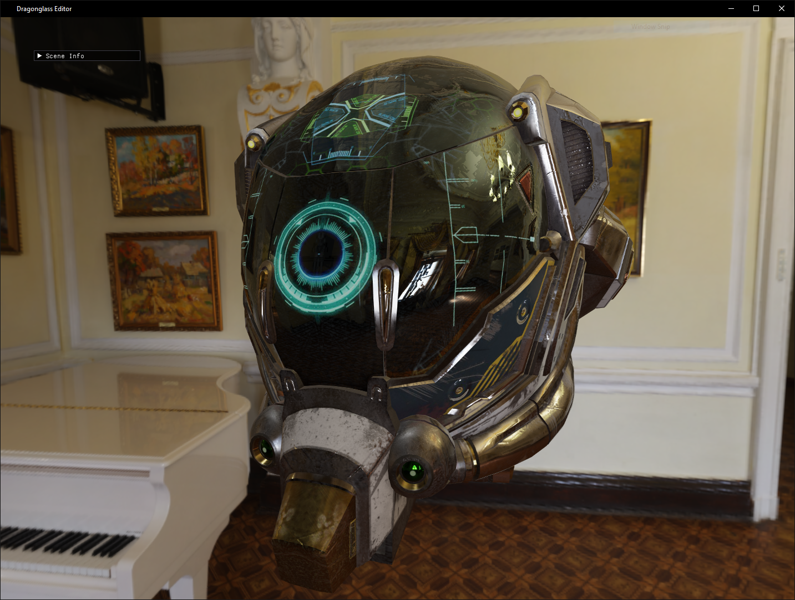
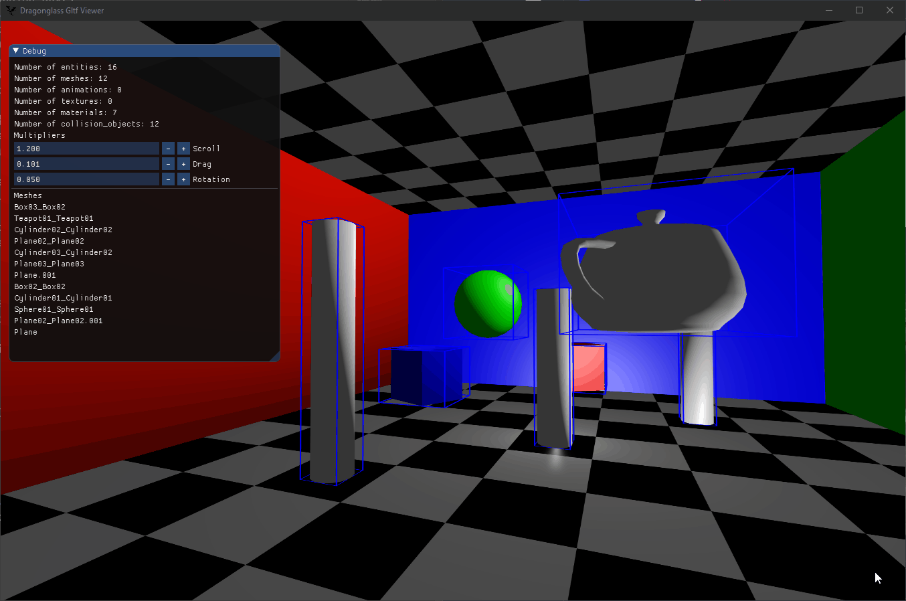
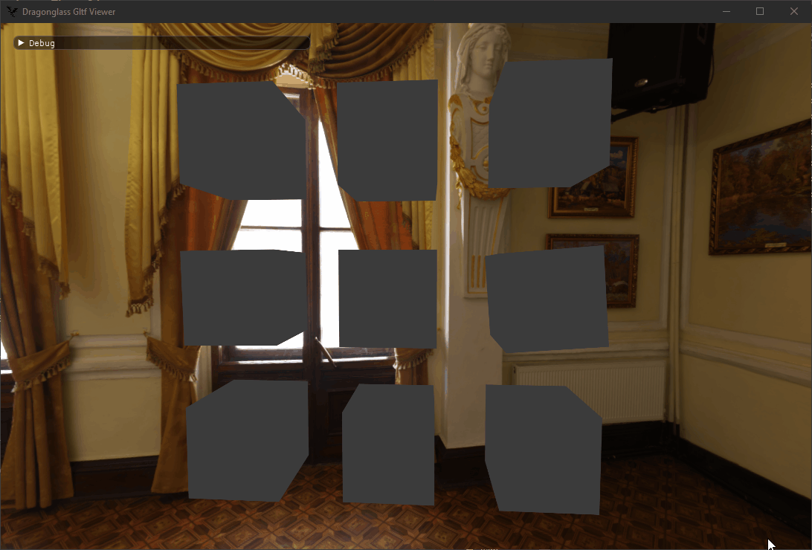

# Dragonglass

Dragonglass is a 3D game engine written in Rust!

## Development Prerequisites

- [Rust](https://www.rust-lang.org/)
- [glslang](https://github.com/KhronosGroup/glslang/releases/tag/master-tot) for shader compilation (glsl -> SPIR-V)
- gcc
- cmake

## Instructions

To run the visual editor for Dragonglass, run this command in the root directory:

```bash
# Vulkan backend
cargo run --release --bin editor
```

## Gallery




